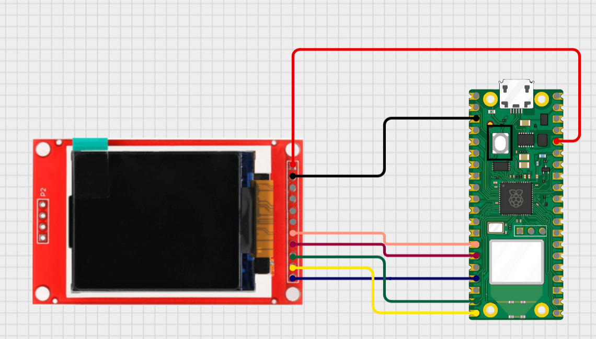

# ELP EMU
Displej co používá KORDIS API pro zobrazování odjezdů
Vytvořeno pro Raspberry Pi Pico W a Pico 2 W

## Návod na zprovoznění ST7735
- Zapoj si to podle pinoutu

- Nainstaluj si [Micropython](https://micropython.org/download/) na svoje Raspberry Pi Pico W nebo Pico 2 W 
- Stáhni si program [ThonnyIDE](https://thonny.org/)
- Stáhni si složku ```ST7735```
- Nakonfiguruj si soubor ```example.config.py``` a ulož ho jako ```config.py```
- Přes ThonnyIDE nahraj na **root** interního uložiště všechny soubory ve složce ```ST7735```

## Návod na zprovoznění terminálové verze
- Nainstaluj si [Micropython](https://micropython.org/download/) na svoje Raspberry Pi Pico W nebo Pico 2 W 
- Stáhni si program [ThonnyIDE](https://thonny.org/)
- Stáhni si soubor ```rpi pico uart - jenom jako proof of concept.py```
- Nakonfiguruj si v něm zastávku a Wi-Fi
- Spusť ho pomocí ThonnyIDE a v Shellu uvidíš odjezdy

## Návod na zprovoznění PC terminál verze
- Nainstaluj si [Python](https://www.python.org/downloads/)
- Stáhni si soubor ```pc terminal version - api test.py```
- Spusť si ho v terminálu